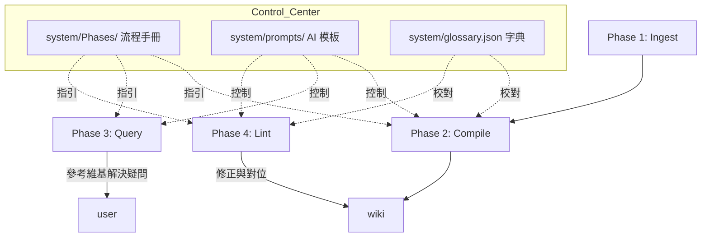

# Second Brain | LLM 知識庫系統

> **基於 AI 編譯器架構的個人維基系統**
> 
> 一個將 LLM 作為核心編譯器的結構化維基系統，強調資料的格式化精煉、用語一致性與自動化維護。

---

## 🌌 系統核心理念

本系統將知識庫視為一個「可編譯」的原始碼庫：
- **LLM 即編譯器**：利用 LLM 的語言理解能力，將雜亂的原始資訊 (Raw) 提煉為結構化的知識 (Wiki)。
- **結構化優先**：透過明確的目錄規範與 Metadata，建立可預測、可檢索的知識網絡。
- **醫學等級結構化 (Medical GRADE)**：Phase 2 專門優化臨床數據提取，支援自動化擷取樣本數 (n)、研究設計與統計數據。
- **AI 指令外部化 (Dynamic Prompts)**：核心 AI 提示詞已遷移至 `system/prompts/`，實現「邏輯與說明」的解耦。
- **用語標準化字典**：內建 `system/glossary.json`，由 AI 自動建議，並由系統在全域自動執行連結替換。
- **自主修復迴圈 (Self-Healing Loop)**：Phase 4 具備自主迭代能力，會自動修復連結、縫合孤立頁面，直到問題歸零。
- **命名規範化**：全面強制落實「中文名 (英文名)」標準，解決編碼異常並提升檢索率。
- **混合檢索 (Hybrid Search)**：整合向量語意分析與字串比對提供精準 RAG。

---

## 🏗️ 系統架構

---

## 📂 目錄結構說明

- **`raw/`**: 存放待處理原始文件（PDF, Web Clip）。
- **`system/`**: **核心治理區**。
    - **`Phases/`**: 存放戰略流程手冊 (給人看的大綱)。
    - **`prompts/`**: 存放技術提示詞模板 (給 AI 讀的密令)。
    - **`glossary.json`**: 術語映射表。
- **`wiki/`**: **結構化維基**。產出具備 YAML Metadata 的概念筆記與摘要。
- **`Attachment/`**: 圖檔與附件。

---

## 🚀 四大階段流程

| 階段 | 名稱 | 說明 | 關鍵特色 |
| :--- | :--- | :--- | :--- |
| **Phase 1** | **Ingest (攝取)** | 收集原始資訊並標準化。 | 自動搬移與過濾 |
| **Phase 2** | **Compile (編譯)** | 醫學等級數據提煉。 | **n 值與 p 值自動擷取** |
| **Phase 3** | **Query (查詢)** | 基於 Wiki 的 RAG 問答。 | **雙語混合檢索** |
| **Phase 4** | **Lint (檢查)** | 全自動連結修正與語意自癒。 | **字典全域自動對位** |

---

## 🛠️ 開始使用

2. **設定 API**：在設定介面填入 Gemini API Key，並選擇偏好的生成模型與 Embedding 模型。
3. **執行工作流**：
    - 將資料放入 `raw/`。
    - 使用 Command Palette 執行 `Run full pipeline` 啟動全自動化編譯流程。
4. **維修與對位**：執行 `Phase 4 lint`。系統會進入自主修復迴圈，自動識別壞軌並補齊缺失的概念內容，直到報告顯示 0 個 Issue。

---

## ⚖️ 系統規範

- **核心區與產出區分離**：`system/` 是流程（邏輯），`wiki/` 是內容（資料）。
- **用語標準化**：若發現同義詞，應將其加入 `system/glossary.json` 以便全域自動修正。

---

## 🧠 自訂 AI 提示詞與知識提取邏輯 (給協作者)

本系統的強大之處在於其**「低程式碼 (Low-Code/No-Code)」**的客製化能力。核心的 AI 邏輯（提示詞）並非寫死在程式碼中，而是存放在 `system/Phases/` 目錄下的 Markdown 檔案裡。這意味著即使您不懂 JavaScript，也可以隨時根據自己的需求微調 AI 的行為。

這套框架已將這些核心提示詞**開源並提交至 Git** 中，讓多位協作者可以共同維護並版控「知識提煉的邏輯」。

### 如何微調需求？
1. **前往 `system/Phases/` 目錄**。
2. **編輯對應的 Phase 檔案**：例如若你想改變 AI 總結文章的方式，請開啟 `Phase-2-Compile.md`。
3. **直接以自然語言修改指令**：
   - **改變關注焦點**：例如在 Prompt 中加入 `「請特別關注與『醫療器械』或『併發症』相關的資訊，並將其整理成獨立段落。」`
   - **調整輸出格式**：例如修改 `# Output Formatting` 區塊，讓 AI 以特定的清單格式或是表格回答。
   - **強化提取限制**：如果 AI 產生的概念太發散，可以加入 `「只提取學術文獻中明確定義的三大核心重點，忽視細節案例。」`

### 重大邏輯演進
由於團隊皆在同一個 Git 倉庫協作，只要有一人優化了 `Phase-2-Compile.md` 中的提煉邏輯，當其他成員 `git pull` 更新後，他們本地端的系統在下一次執行 Compile 時，就會立刻採用最新的、變聰明的大腦。

---
*Developed by [balboku](https://github.com/balboku)*
