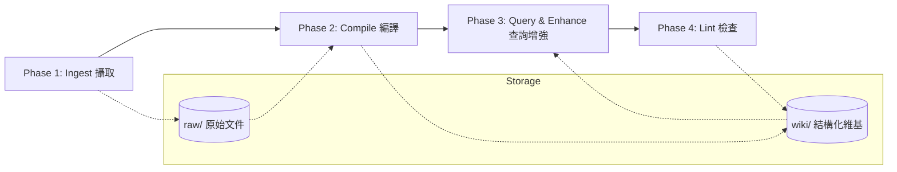

# Second Brain | LLM 知識庫系統

> **基於 AI 編譯器架構的個人維基系統**
> 
> 一個將 LLM 作為核心編譯器的結構化維基系統，強調資料的格式化精煉、用語一致性與自動化維護。

---

## 🌌 系統核心理念

本系統將知識庫視為一個「可編譯」的原始碼庫：
- **LLM 即編譯器**：利用 LLM 的語言理解能力，將雜亂的原始資訊 (Raw) 提煉為結構化的知識 (Wiki)。
- **結構化優先**：透過明確的目錄規範與 Metadata，建立可預測、可檢索的知識網絡。
- **流程自動化**：將知識產出拆分為多個階段，確保每一步都有跡可循。
- **用語標準化字典**：內建 `system/glossary.json`，由 AI 自動建議同義詞對應，並在 Phase 4 自動修正全域連結，解決名稱衝突問題。
- **多模態與大型檔案處理**：整合 Gemini File API，支援大型 PDF 及影音檔直接解析。
- **混合檢索 (Hybrid Search)**：整合 Gemini Embedding 向量語意分析與字串比對，提供最精確的 RAG 查詢基礎。

---

## 🏗️ 系統架構

---

## 📂 目錄結構說明

- **`raw/`**: 存放所有待處理的原始文件（如網頁剪輯、PDF、筆記草稿）。
- **`staging/`**: 處理中的暫存區，用於過渡階段。
- **`system/`**: **核心大腦**。存放流程規範、LLM Prompts、用語字典以及自動化指令。
- **`wiki/`**: **最終產出物**。包含概念文章、整理後的文章、全域索引以及查詢紀錄。
- **`Attachment/`**: 存放圖檔、PDF 等附件資源。

---

## 🚀 四大階段流程

| 階段 | 名稱 | 說明 | 關鍵特色 |
| :--- | :--- | :--- | :--- |
| **Phase 1** | **Ingest (攝取)** | 收集原始資訊並標準化。 | 自動搬移與過濾 |
| **Phase 2** | **Compile (編譯)** | LLM 提煉概念、重構內容。 | **自動建議同義詞字典** |
| **Phase 3** | **Query (查詢)** | 基於 Wiki 進行靈感碰撞與問答。 | **Embedding 向量檢索** |
| **Phase 4** | **Lint (檢查)** | 檢查一致性與修復斷裂連結。 | **用語對位與自動修復** |

---

## 🛠️ 開始使用

1. **環境準備**：使用 Obsidian 開啟此資料夾，並啟用 `Second Brain Pipeline` 外掛。
2. **設定 API**：在設定介面填入 Gemini API Key，並選擇偏好的生成模型與 Embedding 模型。
3. **執行工作流**：
    - 將資料放入 `raw/`。
    - 使用 Command Palette 執行 `Run full pipeline` 啟動全自動化編譯流程。
4. **維修與對位**：執行 `Phase 4 lint` 確保知識庫中所有術語皆已按照字典標準化。

---

## ⚖️ 系統規範

- **核心區與產出區分離**：`system/` 是流程（邏輯），`wiki/` 是內容（資料）。
- **用語標準化**：若發現同義詞，應將其加入 `system/glossary.json` 以便全域自動修正。

---
*Developed by [balboku](https://github.com/balboku)*
