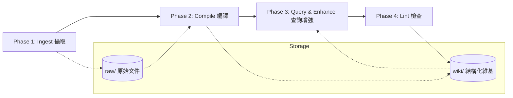

# Second Brain | LLM 知識庫系統

> **基於 Karpathy 架構的個人知識庫系統**
> 
> 一個由 LLM 作為編譯器的結構化維基系統，強調資料的結構化整理與邏輯一致性，無需依賴向量資料庫或嵌入技術。

---

## 🌌 系統核心理念

本系統將知識庫視為一個「可編譯」的原始碼庫：
- **LLM 即編譯器**：利用 LLM 的語言理解能力，將雜亂的原始資訊 (Raw) 提煉為結構化的知識 (Wiki)。
- **結構化優先**：透過明確的目錄規範與 Metadata，建立可預測、可檢索的知識網絡。
- **流程自動化**：將知識產出拆分為多個階段，確保每一步都有跡可循。
- **支援大型檔案處理**：已全面整合 Gemini File API，自動處理大型 PDF 及影音檔，突破 Base64 大小限制。

---

## 🏗️ 系統架構

---

## 📂 目錄結構說明

- **`raw/`**: 存放所有待處理的原始文件（如網頁剪輯、PDF 轉文字、筆記草稿）。
- **`staging/`**: 處理中的暫存區，用於過渡階段。
- **`system/`**: **核心大腦**。存放流程規範、LLM Prompts、操作指南（Phases）以及自動化指令。
- **`wiki/`**: **最終產出物**。包含概念文章、深度整理的文章、全域索引以及查詢紀錄。
- **`Attachment/`**: 存放圖檔、PDF 等附件資源。

---

## 🚀 四大階段流程

| 階段 | 名稱 | 說明 | 關鍵產出 |
| :--- | :--- | :--- | :--- |
| **Phase 1** | **Ingest (攝取)** | 收集原始資訊並標準化。 | `raw/` 中的 Markdown 文件 |
| **Phase 2** | **Compile (編譯)** | LLM 提煉概念、重構內容。 | `wiki/` 中的文章、概念圖 |
| **Phase 3** | **Query (查詢)** | 基於 Wiki 進行靈感碰撞與問答。 | `wiki/queries/` 問答紀錄 |
| **Phase 4** | **Lint (檢查)** | 檢查知識一致性與斷掉的連結。 | 一致性掃描報告 |

---

## 🛠️ 開始使用

1. **環境準備**：使用 [Obsidian](https://obsidian.md/) 開啟此資料夾作為 Vault。
2. **攝取資訊**：將您的資料放入 `raw/`。
3. **執行工作流**：
    - 參閱 `system/Phases/` 下的操作指南進行手動或自動化處理。
    - 推薦配合 LLM 工具（如 Copilot, ChatGPT 或自建 API）進行「編譯」動作。
4. **瀏覽知識**：從 `wiki/全域索引.md` 開始探索您的知識網絡。

---

## ⚖️ 系統規範

- **核心區與產出區分離**：`system/` 是流程（邏輯），`wiki/` 是內容（資料）。
- **Markdown 標準**：所有文件必須符合 Markdown 規範，並包含適當的 YAML Frontmatter。

---
*Developed by [balboku](https://github.com/balboku)*
