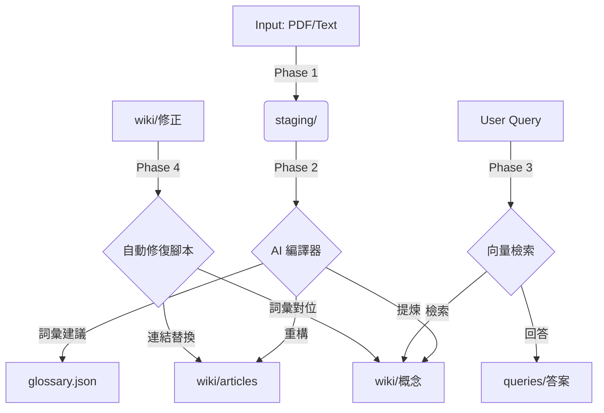

# LLM 知識庫系統：技術架構與邏輯

這份文件詳細說明了 Second Brain 系統的底層運作邏輯，供技術開發與進階調整參考。

## ⚙️ 技術堆疊

- **核心載體**：Obsidian (Markdown Filesystem)
- **邏輯引擎**：Second Brain Pipeline (TypeScript/JavaScript Plugin)
- **推理端點**：Gemini API (3.1 Pro / Flash)
- **語意搜尋**：Gemini Embedding 向量化技術
- **檔案處理**：Gemini File API (支援 PDF/Video)

## 🔄 四大核心階段與閉環

### Phase 1: Ingest (攝取)
將來自不同來源的 Raw Data 進行分類與標準化。PDF 會在此階段被標記，待 Phase 2 直接透過 API 並發處理。

### Phase 2: Compile (編譯)
這是「編譯器」的心臟。
- **用語注入**：在產出 [[WikiLink]] 前，系統會先注入現有的 `glossary.json` 對位表。
- **自動學習**：AI 會在理解內文時歸納出潛在的同義詞，並回傳至外掛進行字典合併。

### Phase 3: Query (查詢增強)
使用 RAG (Retrieval-Augmented Generation) 技術。
- **向量匹配**：將使用者的問題透過 `Gemini Embedding` 轉化為向量，與全 Wiki 庫進行相似度匹配。
- **上下文拼接**：將匹配到的最相關段落餵給 LLM 進行最後的精細回答。

### Phase 4: Lint (檢修)
維持知識庫的高熵減。
- **確定性腳本**：採用對位 Regex 腳本直接修正檔案中的術語與路徑，確保 100% 準確率。
- **存根修復**：自動發現 404 連結並建立 Markdown 存根页。

## 📊 資料流向圖

## 🔐 隱私與安全性
- **本地端優先**：所有原始資料保持在您的磁碟中，只有在「編譯」與「查詢」時才會將必要片段加密傳送至 Gemini API。
- **不洩漏字典**：您的自訂術語與流程規則僅存在於 `system/` 中，外掛設計已確保不將機密設定寫入公開 Wiki。

---
*Created by balboku | Updated at 2026-04-18*
